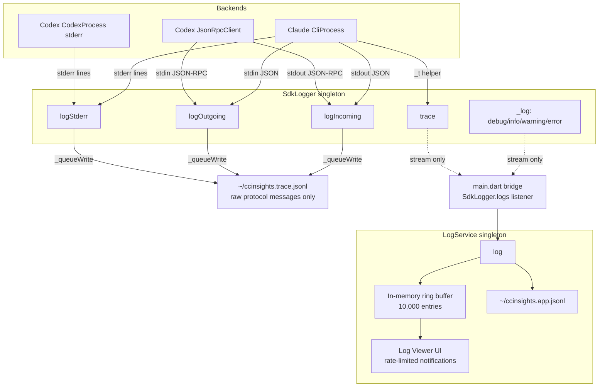
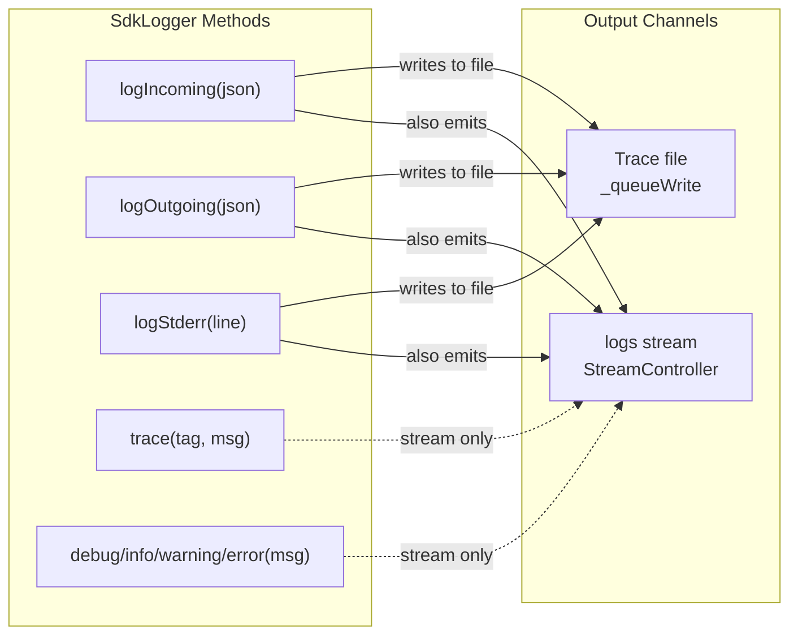
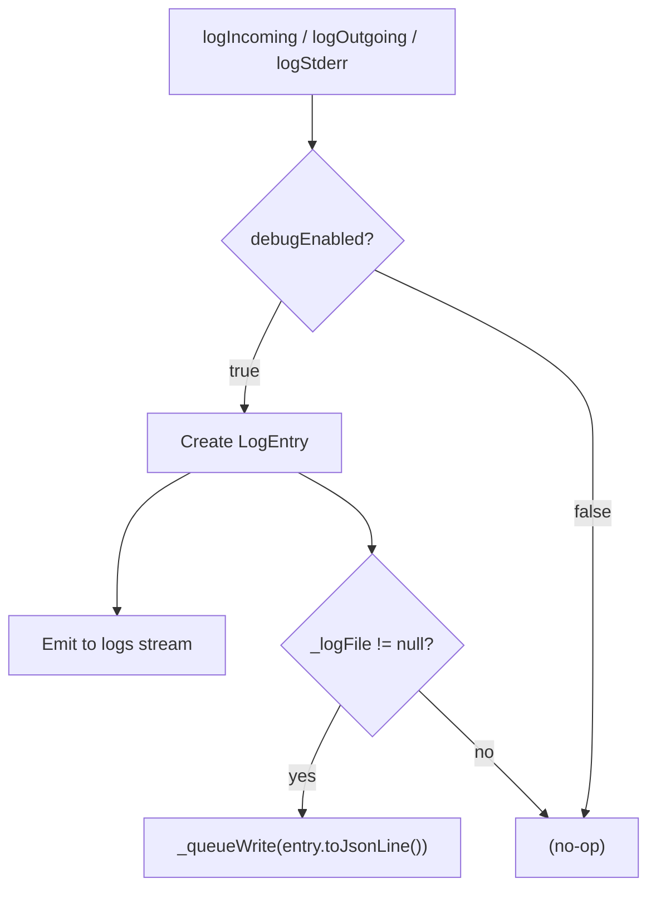

# Logging System

CC-Insights has two separate logging systems serving distinct purposes: a **trace log** for raw backend protocol messages, and an **application log** for everything else.

## Overview



## Two Log Files

| File | Default Path | Contents | Format |
|------|-------------|----------|--------|
| **Trace log** | `~/ccinsights.trace.jsonl` | Raw JSON messages between backends and their CLI subprocesses | JSONL (one JSON object per line) |
| **App log** | `~/ccinsights.app.jsonl` | Application-level events: diagnostics, warnings, errors, state changes | JSONL (one JSON object per line) |

### Trace Log

Contains **only** raw protocol messages — the exact JSON exchanged over stdin/stdout with backend CLIs, plus stderr output. This is the primary debugging tool for protocol-level issues.

Every line is a valid JSON object with this structure:

```jsonc
// Incoming/outgoing message (stdin/stdout)
{"timestamp":"...","level":"debug","direction":"stdout","content":{/* raw CLI JSON */}}

// Stderr line
{"timestamp":"...","level":"debug","direction":"stderr","text":"..."}
```

The `direction` field indicates:
- `stdin` — message sent TO the CLI
- `stdout` — message received FROM the CLI
- `stderr` — stderr output from the CLI process

### App Log

Contains structured application-level log entries:

```jsonc
{"timestamp":"...","level":"info","source":"App","message":"CC Insights starting up"}
{"timestamp":"...","level":"warn","source":"SDK","message":"systemPrompt is ignored by Codex backend"}
{"timestamp":"...","level":"debug","source":"CCI:ChatState","message":"sendMessage: hello (chat=chat-123, images=0)"}
```

## Components

### SdkLogger (`agent_sdk_core/lib/src/sdk_logger.dart`)

A singleton that serves as the central hub for all SDK-level logging. It has two output channels:

1. **File output** (trace log) — only for raw protocol messages
2. **Stream output** (`logs`) — for all entries, consumed by the frontend bridge



**Key design rule:** Only `logIncoming`, `logOutgoing`, and `logStderr` write to the trace file. Internal messages (`trace`, `debug`, `info`, `warning`, `error`) emit to the `logs` stream only, where they are picked up by the frontend bridge and routed to `LogService`.

#### Write Queue

File writes use a queue to prevent corruption from concurrent calls:

```dart
void _queueWrite(String line) {
  _writeQueue.add(line);
  _processWriteQueue();  // drains queue sequentially
}
```

Since Dart is single-threaded, the `_isWriting` flag acts as a cooperative mutex — if a write is in progress, new entries queue up and the active writer drains them all.

#### Enabling

SdkLogger requires **both** `debugEnabled = true` and a file path to write:



### LogService (`frontend/lib/services/log_service.dart`)

The application-level logging singleton. Manages:

- **In-memory ring buffer** (10,000 entries) for the log viewer UI
- **File output** to `~/ccinsights.app.jsonl` (with configurable minimum level)
- **Rate-limited notifications** (max 10/sec) to `ChangeNotifier` listeners

Log levels (ordered by severity):
`trace` < `debug` < `info` < `notice` < `warn` < `error`

### Frontend Bridge (`frontend/lib/main.dart`)

Connects `SdkLogger` to `LogService` by listening to the `SdkLogger.logs` stream and forwarding internal entries:

```dart
SdkLogger.instance.logs.listen((entry) {
  if (entry.direction != LogDirection.internal) return;
  // Map SDK log levels to LogService levels and forward
  LogService.instance.log(source: ..., level: ..., message: entry.message);
});
```

Only `internal` direction entries are forwarded. Raw protocol messages (`stdin`/`stdout`/`stderr`) are already written to the trace file by `SdkLogger` and are not duplicated into the app log.

## Backend Integration

Both backends route their protocol I/O through `SdkLogger`:

### Claude CLI Backend

`CliProcess` (`claude_dart_sdk/lib/src/cli_process.dart`) calls:
- `SdkLogger.instance.logIncoming(json)` — on each parsed stdout JSON line
- `SdkLogger.instance.logOutgoing(message)` — on each stdin send
- `SdkLogger.instance.logStderr(line)` — on each stderr line

### Codex Backend

`JsonRpcClient` (`codex_dart_sdk/lib/src/json_rpc.dart`) calls:
- `SdkLogger.instance.logIncoming(json)` — on each parsed JSON-RPC response/notification
- `SdkLogger.instance.logOutgoing(message)` — on each JSON-RPC request/notification sent

`CodexProcess` (`codex_dart_sdk/lib/src/codex_process.dart`) calls:
- `SdkLogger.instance.logStderr(line)` — on each stderr line

The Codex backend also has a separate edge log (`CODEX_RPC_LOG_FILE` env var) that predates the unified trace log. The `SdkLogger` integration is the canonical path.

## Configuration

All logging settings are in **Settings > Developer**:

| Setting | RuntimeConfig Key | Default | Description |
|---------|------------------|---------|-------------|
| Debug SDK Logging | `developer.debugSdkLogging` | `false` | Enables trace file writing and diagnostic messages |
| Exclude Streaming Deltas | `developer.traceExcludeDeltas` | `true` | Exclude high-frequency delta messages from trace file |
| Trace Log Path | `developer.traceLogPath` | `~/ccinsights.trace.jsonl` | Path to the trace log file |
| App Log Path | `logging.filePath` | `~/ccinsights.app.jsonl` | Path to the application log file |
| Minimum Log Level | `logging.minimumLevel` | `debug` | Minimum level for app log file output |

Environment variables (override settings):
- `CLAUDE_SDK_DEBUG=true` — enable SdkLogger debug mode
- `CLAUDE_SDK_LOG_FILE=/path` — set trace log path

### Delta Filtering

The Codex backend sends high-frequency streaming delta notifications (one per token). These can make a brief conversation produce thousands of trace log lines. By default, delta messages are **excluded** from the trace file.

Filtered method patterns (any method ending with these suffixes):
- `*/delta` — e.g. `item/agentMessage/delta`, `item/plan/delta`
- `*Delta` — e.g. `item/commandExecution/outputDelta`, `item/reasoning/summaryTextDelta`
- `*_delta` — e.g. `codex/event/agent_message_content_delta`, `codex/event/agent_message_delta`

Delta messages are still emitted to the `SdkLogger.logs` stream (and therefore available in the app log viewer). Only the trace file write is skipped.

To include deltas in the trace file, set **Exclude Streaming Deltas** to `false` in Settings > Developer.

## Debugging Tips

### Watching the trace log live

```bash
tail -f ~/ccinsights.trace.jsonl
```

### Filtering by direction

```bash
# Only outgoing messages (what we send to CLIs)
grep '"direction":"stdin"' ~/ccinsights.trace.jsonl | jq .

# Only incoming messages (what CLIs send back)
grep '"direction":"stdout"' ~/ccinsights.trace.jsonl | jq .

# Only stderr
grep '"direction":"stderr"' ~/ccinsights.trace.jsonl | jq .
```

### Extracting raw protocol content

```bash
# Pretty-print the raw JSON content of each message
jq '.content // .text' ~/ccinsights.trace.jsonl
```

### Watching app-level events

```bash
tail -f ~/ccinsights.app.jsonl | jq .
```
