# InsightsEvent Protocol - Overview

The InsightsEvent protocol is a provider-neutral event model that unifies communication between multiple AI coding agent backends (Claude CLI, Codex CLI, ACP-compatible agents) and the CC-Insights frontend. Rather than forcing each backend into a lowest-common-denominator format, it preserves the full richness of each provider while giving the frontend a single typed interface to consume.

---

## High-Level Architecture

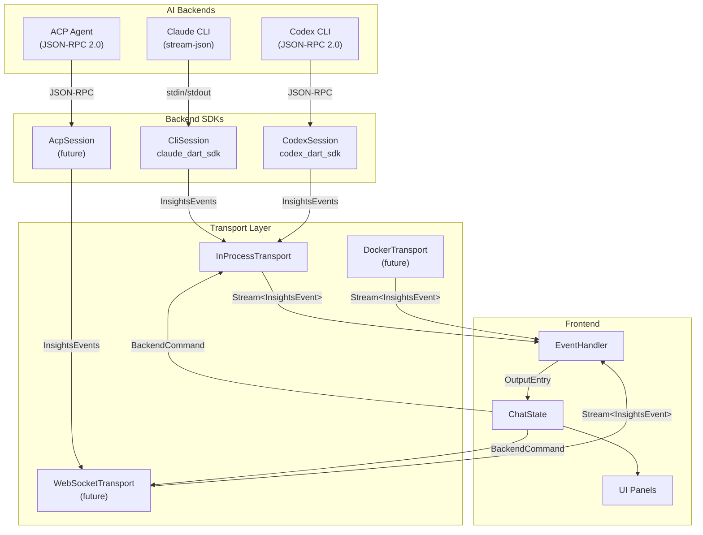

---

## Event Flow

This diagram shows the lifecycle of a single user turn - from the user sending a message to the turn completing.

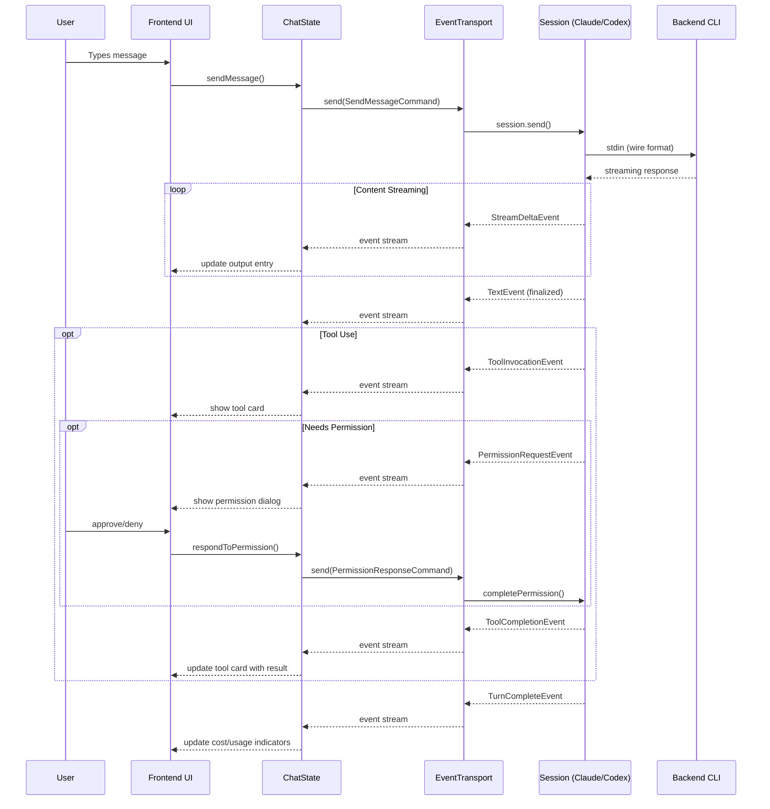

---

## InsightsEvent Type Hierarchy

All events share a common base with `id`, `timestamp`, `provider`, and optional `raw`/`extensions` fields.

```mermaid
classDiagram
    class InsightsEvent {
        <<sealed>>
        +String id
        +DateTime timestamp
        +BackendProvider provider
        +Map~String,dynamic~? raw
        +Map~String,dynamic~? extensions
    }

    class SessionInitEvent {
        +String? model
        +String? cwd
        +List~String~? tools
        +List~String~? mcpServers
        +Map? accountInfo
    }

    class SessionStatusEvent {
        +SessionStatus status
        +String? message
    }

    class TextEvent {
        +String text
        +TextKind kind
        +String? agentId
    }

    class ToolInvocationEvent {
        +String callId
        +ToolKind kind
        +String toolName
        +Map~String,dynamic~ input
        +List~String~? locations
        +String? agentId
    }

    class ToolCompletionEvent {
        +String callId
        +ToolCompletionStatus status
        +String? output
        +bool isError
        +List? contentBlocks
    }

    class TurnCompleteEvent {
        +double? costUsd
        +int? inputTokens
        +int? outputTokens
        +Duration? duration
        +Map? modelUsage
    }

    class PermissionRequestEvent {
        +String requestId
        +String toolName
        +Map~String,dynamic~ toolInput
        +List? suggestions
        +String? blockedPath
    }

    class StreamDeltaEvent {
        +StreamDeltaKind kind
        +String delta
        +String? callId
    }

    class SubagentSpawnEvent {
        +String parentCallId
        +String agentId
        +String? description
    }

    class SubagentCompleteEvent {
        +String agentId
        +String parentCallId
    }

    class ContextCompactionEvent {
        +String? trigger
        +int? preTokens
        +int? postTokens
        +String? summary
    }

    class UserInputEvent {
        +String text
        +List? images
    }

    InsightsEvent <|-- SessionInitEvent
    InsightsEvent <|-- SessionStatusEvent
    InsightsEvent <|-- TextEvent
    InsightsEvent <|-- ToolInvocationEvent
    InsightsEvent <|-- ToolCompletionEvent
    InsightsEvent <|-- TurnCompleteEvent
    InsightsEvent <|-- PermissionRequestEvent
    InsightsEvent <|-- StreamDeltaEvent
    InsightsEvent <|-- SubagentSpawnEvent
    InsightsEvent <|-- SubagentCompleteEvent
    InsightsEvent <|-- ContextCompactionEvent
    InsightsEvent <|-- UserInputEvent
```

---

## ToolKind Categories (ACP-Aligned)

Tools are classified using ACP's `kind` vocabulary, enabling consistent UI rendering regardless of backend.

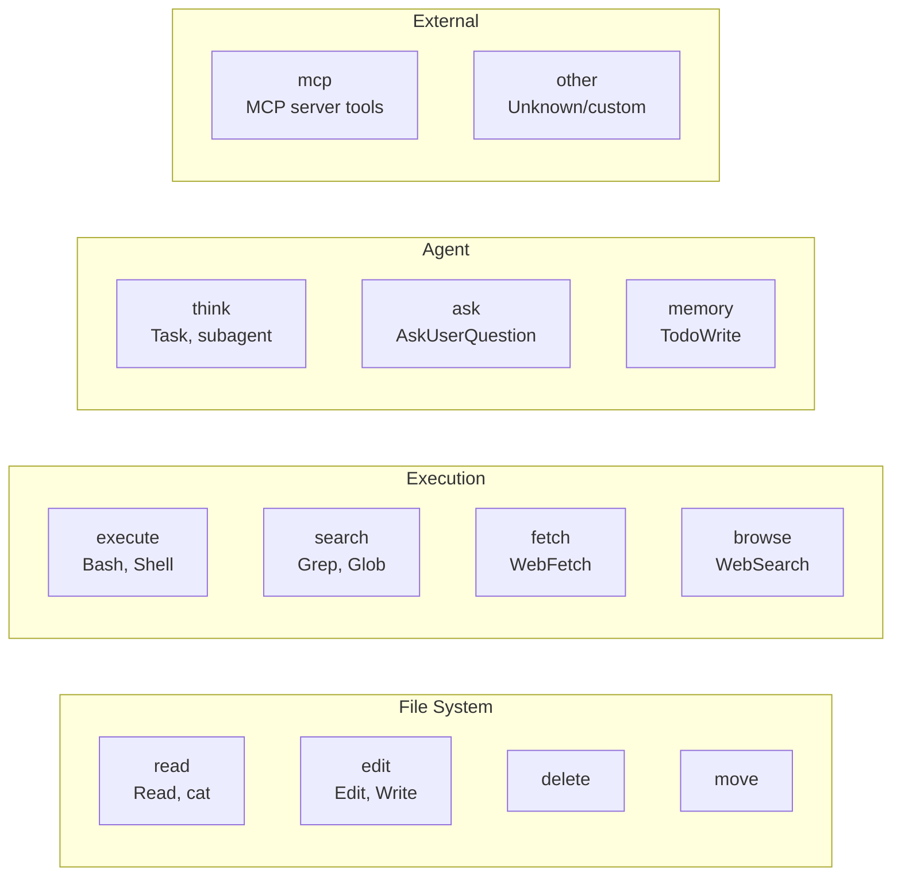

---

## Backend Command Flow

Commands flow from the frontend to the backend through the transport layer.

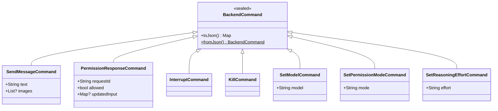

---

## Transport Abstraction

The `EventTransport` interface decouples the frontend from session implementation details, enabling future remote backends without frontend changes.

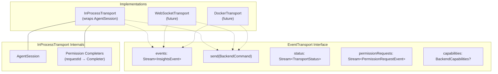

---

## Backend Capability Comparison

Each backend provides different levels of detail. The frontend adapts its UI based on what data is available.

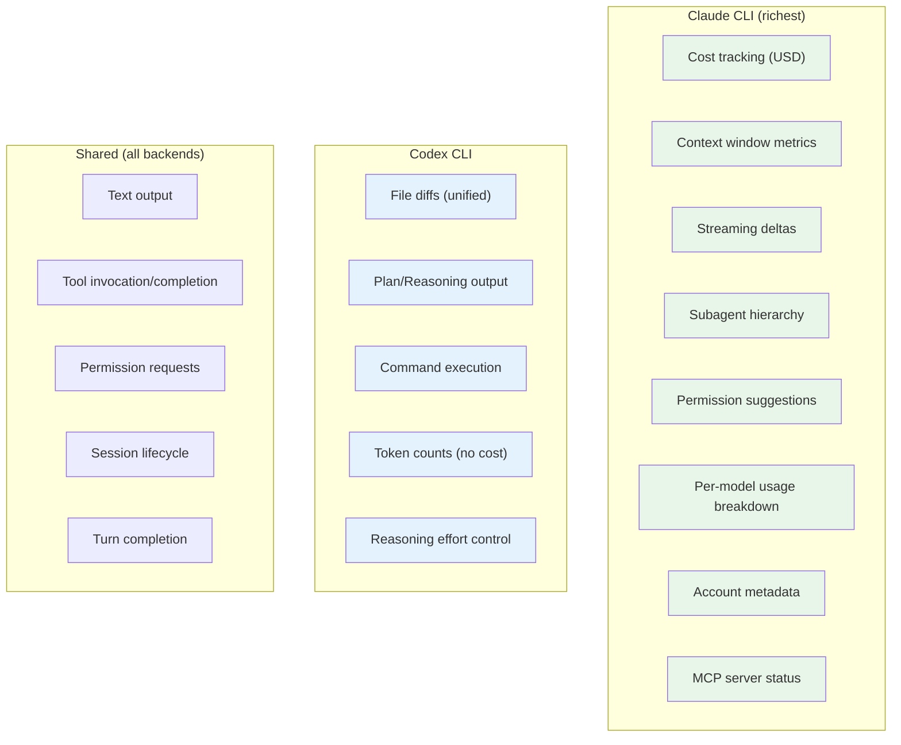

---

## Frontend Event Processing

The `EventHandler` converts `InsightsEvent` objects into `OutputEntry` models for the UI.

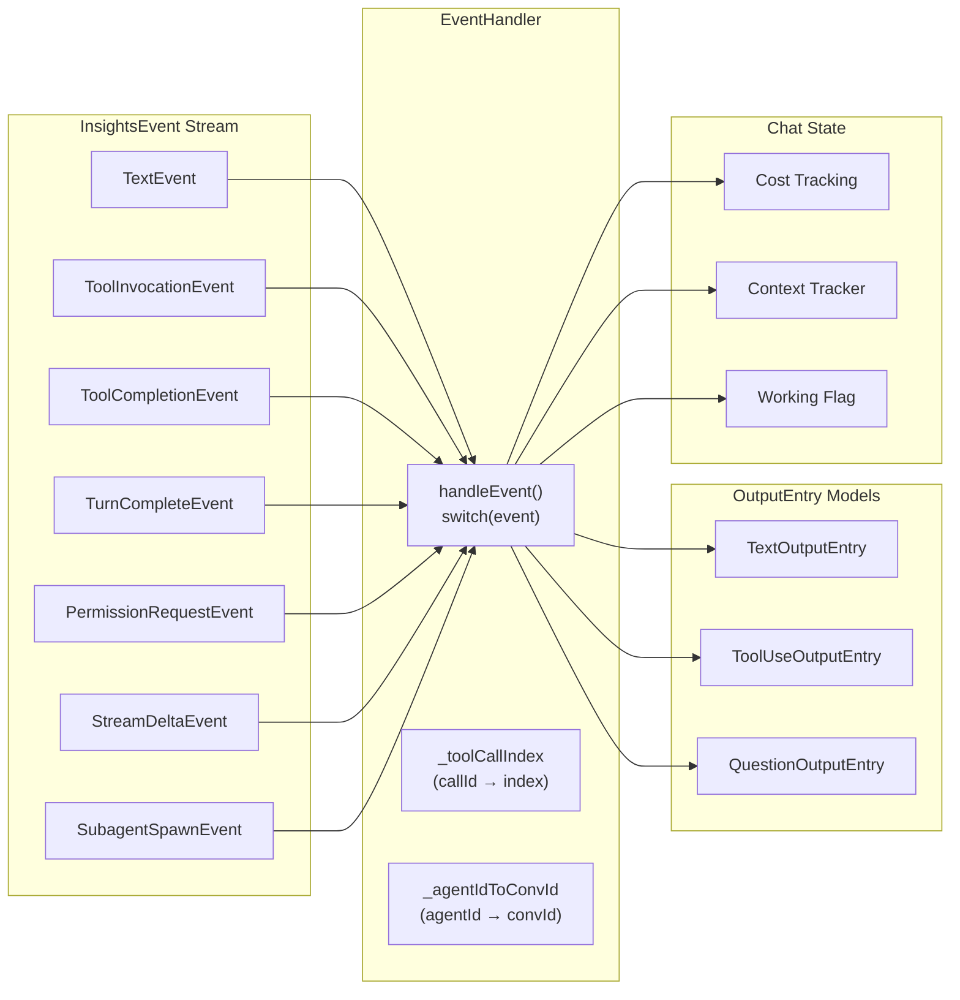

---

## Permission Flow (Cross-Backend)

Each backend handles permissions differently, but the frontend presents a unified dialog.

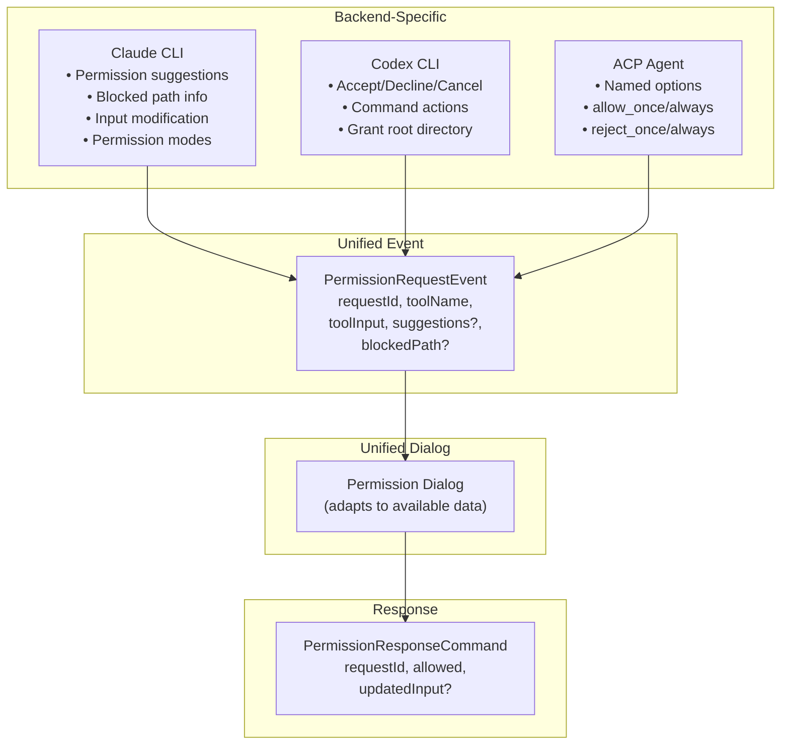

---

## Streaming Model

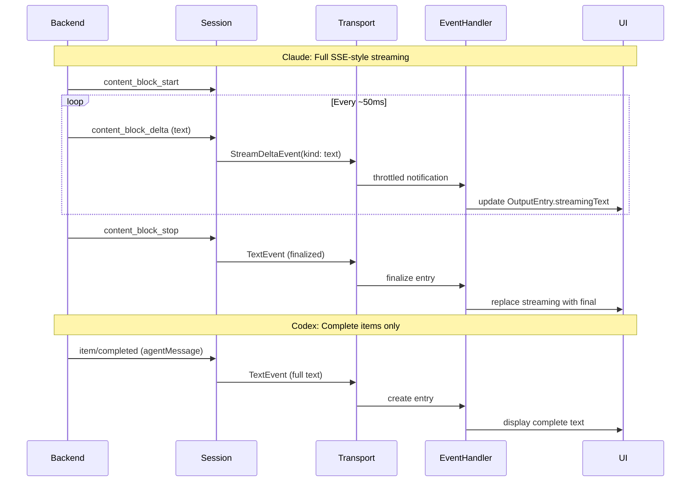

---

## Subagent Hierarchy

Claude supports nested subagents (via the Task tool). The protocol tracks parent-child relationships.

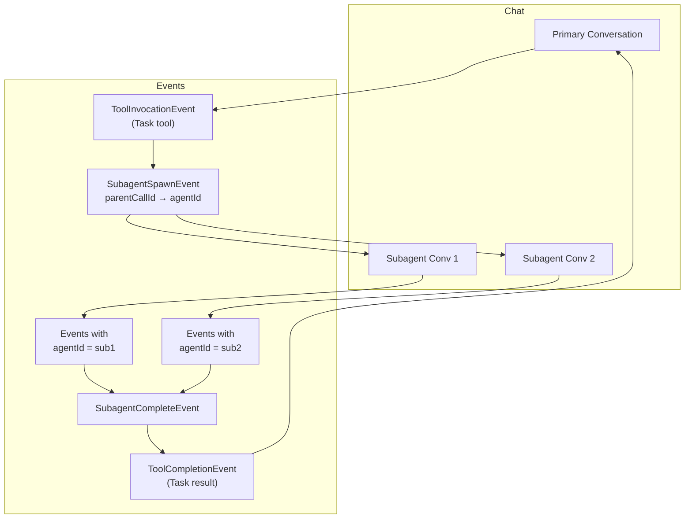

---

## Key Design Principles

1. **No lowest-common-denominator** - Each backend's full richness is preserved via the `extensions` map and nullable fields
2. **Backend-specific extensions welcome** - Claude's cost data, Codex's diffs, ACP's option-based permissions all coexist
3. **Typed, not stringly** - Dart sealed classes with exhaustive `switch` ensure the compiler catches missing event handling
4. **ACP-aligned semantics** - `ToolKind` uses ACP's vocabulary so future ACP backends map directly
5. **Transport-separable** - All events and commands are JSON-serializable for future WebSocket/Docker transports
6. **Raw data preserved** - The `raw` field contains original wire-format data for debugging

---

## Further Reading

| Document | Contents |
|----------|----------|
| [01-overview.md](01-overview.md) | Problem statement and design goals |
| [02-event-model.md](02-event-model.md) | Complete InsightsEvent type hierarchy |
| [03-claude-mapping.md](03-claude-mapping.md) | Claude CLI stream-json → InsightsEvent |
| [04-codex-mapping.md](04-codex-mapping.md) | Codex JSON-RPC → InsightsEvent |
| [05-gemini-acp-mapping.md](05-gemini-acp-mapping.md) | ACP/Gemini → InsightsEvent |
| [06-frontend-consumption.md](06-frontend-consumption.md) | EventHandler and UI patterns |
| [07-transport-separation.md](07-transport-separation.md) | Docker/WebSocket transport design |
| [08-permissions.md](08-permissions.md) | Permission model deep dive |
| [09-streaming.md](09-streaming.md) | Streaming across backends |
| [10-migration.md](10-migration.md) | Phased migration guide |
